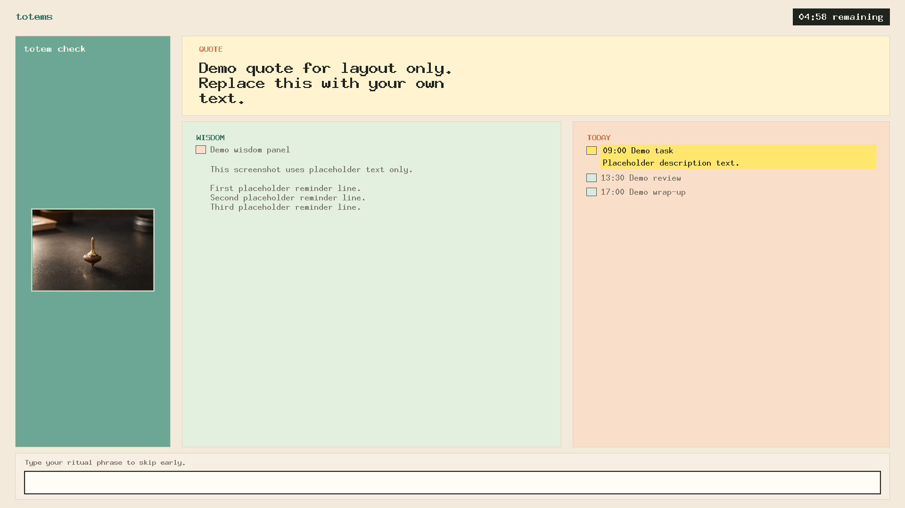

# totems


A small Python desktop app that pops up an always-on-top "soft block" window every 45 minutes of wall-clock time, showing a quote, wisdom reminders, today's agenda, and a totem symbol. Dismiss the block early by typing a ritual phrase you set yourself.

The whole block window - the quote, the wisdom items, today's agenda, the totem symbol, your ritual phrase - is the totem. It's yours, customizable end to end, and it's what pulls you out of the rabbit hole. The name is inspired by the [totems in *Inception*](https://inception.fandom.com/wiki/Totem): personal objects used to check what is real.

## Demo



## Run

```sh
uv run totems                  # start the loop
uv run totems --debug-now      # one immediate block (1-min timer), then exit
uv run totems --debug-calendar # print today's calendar items, then exit
uv run totems --fast           # 5-second cycles for testing
uv run totems --settings       # edit config/content in a GUI
```

First run will prompt for your ritual phrase and write
`~/.config/totems/config.toml`.

The default rhythm is 45 minutes of work followed by a 5-minute block. Change
those intervals in the settings editor or by editing `[timing]` in
`config.toml`.

While the loop is running, the terminal shows a live countdown to the next
block (`next block in MM:SS`). Press `p` to pause the cycle (handy for lunch or
a meeting) and `p` again to resume. `Ctrl-C` quits.

## Config files

```
~/.config/totems/
├── config.toml       # ritual phrase, intervals, duty source choices
├── content.json      # preferred content pool format
├── quotes.txt        # one quote per line
├── wisdom.txt        # one wisdom reminder per line
├── duties.txt        # today's agenda - one item per line
├── totem_symbols/    # local symbol images (.png, .gif); empty -> cataas.com fallback
└── .cache/
    └── google_calendar.json   # auto-managed stale-cache fallback
```

Preferred content format:

Use the settings UI for normal editing:

```sh
uv run totems --settings
```

It presents quotes, wisdom, and duties as records. Each record can contain real
line breaks; add a blank record via the buttons rather than typing JSON escapes
like `\n`.

```json
{
  "quotes": [
    "Attention is the beginning of devotion.",
    "Do the next honest thing."
  ],
  "wisdom": [
    "Five faults: 1. laziness; 2. forgetting the instruction; 3. agitation and dullness; 4. non-application; 5. over-application.",
    "Eight antidotes: 1. faith; 2. aspiration; 3. effort; 4. pliancy; 5. mindfulness; 6. awareness; 7. application; 8. equanimity."
  ],
  "duties": [
    "Review notes",
    "Pay rent",
    "3pm dentist"
  ]
}
```

If `content.json` exists, it is used for quotes, wisdom, and duties. The older text files still work as fallback. Blank lines and lines starting with `#` are ignored in the text files. Duplicates are removed by exact text match, so capitalization changes are kept as separate items.

By default, `quotes.txt` and `wisdom.txt` are merged with bundled defaults. To use only your own files, set this in `config.toml`:

```toml
[content]
mode = "replace"
```

### Connecting Google Calendar

Use a private iCal URL from Google Calendar. No OAuth is needed; the URL itself
is the credential.

1. Open Google Calendar in a desktop browser.
2. In the left sidebar, find the calendar under **My calendars**.
3. Hover it, click the three-dot menu, then click **Settings and sharing**.
4. Scroll to **Integrate calendar**.
5. Copy **Secret address in iCal format**.
6. Run the settings editor:

```sh
uv run totems --settings
```

7. Paste the URL into **Google Calendar URLs**, one URL per line.
8. Wait for autosave or click **Save**.
9. Test it:

```sh
uv run totems --debug-calendar
```

If setup worked, that command prints today's calendar items, one per line.
The next block window will show them in the Today card.

If you only see **Public address in iCal format**, that URL only works for
public calendars. For private event details, use **Secret address in iCal
format**. On Google Workspace accounts, an admin may hide or disable secret
iCal links.

You can also edit `config.toml` directly:

```toml
[duty_source]
kinds = ["textfile", "google_calendar"]

[duty_source.google_calendar]
urls = [
    "https://calendar.google.com/calendar/ical/.../basic.ics",
]
```

The app fetches each URL once per block, expands recurring events, and falls
back to `.cache/google_calendar.json` if every calendar fetch fails.

## Tests

```sh
uv run pytest
```

GUI smoke tests are skipped automatically when `$DISPLAY` is unset.

## Acknowledgements

The owner of this repo would like to thank Claude-champ, Gemini-san, and Codex-bro for this project execution.
